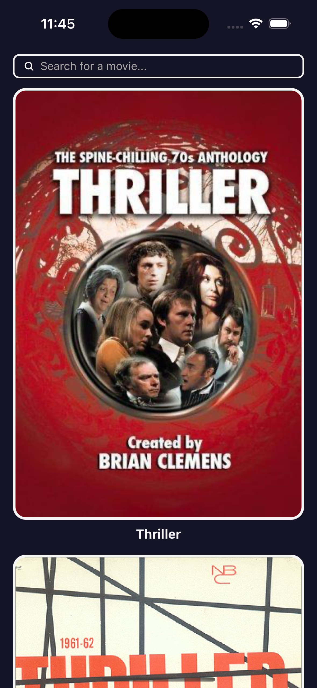

# Qualgo Assignment

See [assignment.md](./docs/assignment.md) for the assignment details.

## Summary

This project is a monorepo managed by Nx. It contains two projects:

- `apps/mobile`: A React Native project that implements the assignment requirements.
- `libs/movie-api`: A TypeScript library that encapsulates the logic for fetching movie data from the API.

## How to run the project

Since the monorepo is created and managed by Nx. To run the project, you need to have Nx installed globally.

```bash
npm add --global nx@latest
```

Assuming you already have React Native development environment setup, follow the steps below to run the project.

Then install the dependencies by running this at the root of the project.

```bash
yarn
```

### iOS

> Note: To run the iOS application, you need to have Xcode & CocoaPod installed.

To install the pods, run:

```bash
yarn nx run mobile:pod-install
```

To run the iOS application, run:

```bash
yarn nx run mobile:run-ios
```

### Android

> Note: Please make sure you have an Android emulator running or a physical device connected.

To run the Android application, run:

```bash
yarn nx run mobile:run-android
```

## Test

### Unit Test

To run mobile app unit tests, run:

```bash
yarn nx run mobile:test
```

To run movie api library unit tests, run:

```bash
yarn nx run movie-api:test
```

## Screenshots

### iOS

| Context                                | Screenshot                                             |
| -------------------------------------- | ------------------------------------------------------ |
| Home screen                            |                |
| Search screen                          |              |
| Search screen with result              |  |
| Movie detail screen                    |              |
| Movie detail screen - scroll to bottom |       |

### Android

| Context                                | Screenshot                                                 |
| -------------------------------------- | ---------------------------------------------------------- |
| Home screen                            |                |
| Search screen                          |              |
| Search screen with result              |  |
| Movie detail screen                    |              |
| Movie detail screen - scroll to bottom |       |
