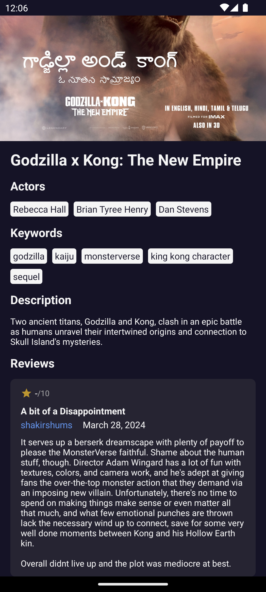

# Qualgo Assignment

See [assignment.md](./docs/assignment.md) for the assignment details.

## Summary

This project is a monorepo managed by Nx. It contains two projects:

- `apps/mobile`: A React Native project that implements the assignment requirements.
- `libs/movie-api`: A TypeScript library that encapsulates the logic for fetching movie data from the API.

## How to run the project

Since the monorepo is created and managed by Nx. To run the project, you need to have Nx installed globally.

```
npm add --global nx@latest
```

Assuming you already have React Native development environment setup, follow the steps below to run the project.

Install the dependencies by running `yarn` at the root of the project.

### iOS

Run `yarn nx run mobile:pod-install` to install pods.

Run `yarn nx run mobile:run-ios` to build and run the iOS application.

### Android

> Please make sure you have an Android emulator running or a physical device connected.

Run `yarn nx run mobile:run-android` to build and run the Android application.

## Test

### Unit Test

Run `yarn nx run mobile:test` to run the unit tests for the mobile app.

Run `yarn nx run movie-api:test` to run the unit tests for the movie api library.

## Screenshots

### iOS

| Context                                | Screenshot                                             |
| -------------------------------------- | ------------------------------------------------------ |
| Home screen                            |                |
| Search screen                          |              |
| Search screen with result              |  |
| Movie detail screen                    |              |
| Movie detail screen - scroll to bottom |       |

### Android

| Context                                | Screenshot                                                 |
| -------------------------------------- | ---------------------------------------------------------- |
| Home screen                            |                |
| Search screen                          |              |
| Search screen with result              |  |
| Movie detail screen                    |              |
| Movie detail screen - scroll to bottom |       |
